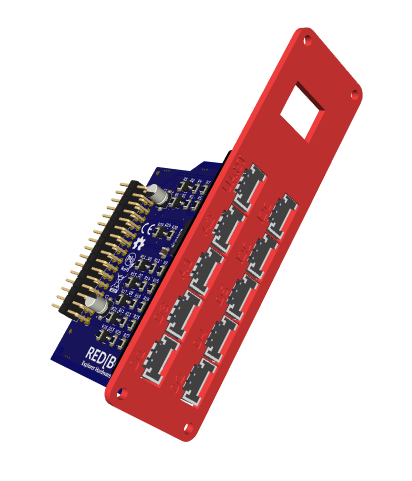
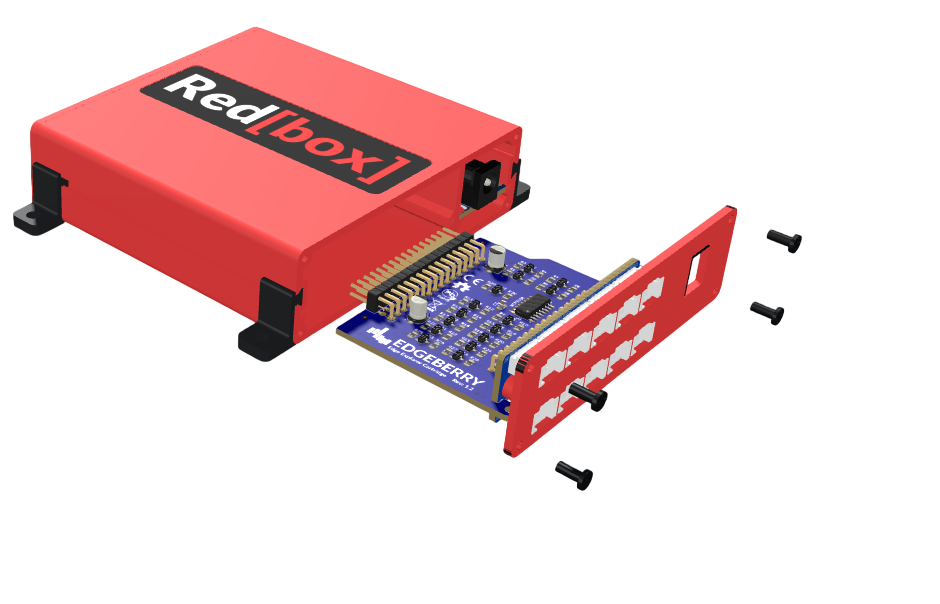

The **Redbox Explorer Hardware Cartridge** is designed for easily connecting sensors, actuators, and other peripherals to your system. It features the widely used 4-pin 2.0 mm pitch JST-PH connector, compatible with modules and breakouts from popular ecosystems like [Grove](https://www.seeedstudio.com/catalogsearch/result/?q=grove), [Crowtail](https://www.elecrow.com/catalog/category/view/s/crowtail/id/13/), and [STEMMA](https://www.adafruit.com/category/1005).

#### Ports:
- **5x Digital in/out** (with PWM on D1)
- **2x Analog input** (0-5V)
- **1x UART**
- **2x I2C**

 

## Usage

The _Hardware Cartridge_ slides into the expansion slot in the back of the controller. The faceplate model for 3D printing can be found [here](Documentation/Redbox_Explorer_Cartridge_faceplate.stl). 

Connect modules from a wide range of ecosystems using the `HY2.0-4P` connector (commonly known as the _Grove_ connector) to their respective port type (analog/digital/...).

 

### Layout

| Port     | Type         | Raspberry Pi GPIO Pin     | Info |
|----------|--------------|---------------------------|------|
| **D1**   | Digital I/O  | GPIO12  GPIO20        | Hardware PWM capable* |
| **D2**   | Digital I/O  | GPIO21  GPIO16        |      |
| **D3**   | Digital I/O  | GPIO13  GPIO24        |      |
| **D4**   | Digital I/O  | GPIO25  GPIO22        |      |
| **D5**   | Digital I/O  | GPIO23  GPIO27        |      |
| **A1**   | Analog input   0...5V | *ADC* CH0  *ADC* CH1  | via MCP3008 on SPI     |
| **A2**   | Analog input   0...5V | *ADC* CH2  *ADC* CH3  | via MCP3008 on SPI     |
| **I2C**  | I2C bus      | I2C SDA  I2C SDL      |      |
| **UART** | Serial bus     | UART RX  UART TX      |      |

_*Hardware PWM on Raspberry Pi 3B+/4B/5B/Zero 2W_

>[!WARNING]
>The digital I/O lines on this Hardware Cartridge use a passive N-MOSFET level-shifting circuit designed for compatibility with standard open-drain and push-pull I/O configurations.

## License & Collaboration
**Copyright© 2024 Sanne 'SpuQ' Santens**. This project is released under the **CERN OHL-W** license. Rules & guidelines apply to the usage of the Redbox brand.

### Collaboration

If you'd like to contribute to this project, please follow these guidelines:
1. Fork the repository and create your branch from `main`.
2. Make your changes and ensure they adhere to the project's design style and conventions.
3. Test your changes thoroughly.
4. Ensure your commits are descriptive and well-documented.
5. Open a pull request, describing the changes you've made and the problem or feature they address.
